# Using the GUI

## Lateral panel (menu)
Here we provide an explanation of the key features of a GUI designed to ease the interaction with the ecological database presented in a companion paper. This GUI allows users to insert, update, delete or visualize data.

The GUI is organized using the _shiny_ [[1]](#1) and _shinydashboard_ [[2]](#2) packages. On the left side there is a lateral panel with the main menu of this GUI. 

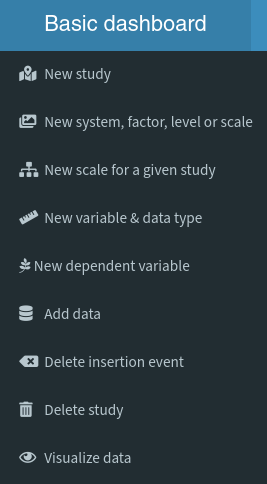

Items in the menu are presented in an order that reflects a typical workflow. Below we provide a brief guide to explore the functionality of the GUI. The files used as examples can be found in the *files* folder.

## Redirect message
Before entering the GUI there is a nearly blank html page that is needed for the proper functioning of the menu. Just press the link and enjoy ("suffer" is probably a more appropriate term here).

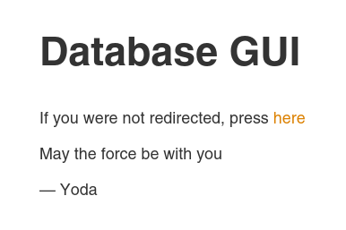

## Welcome screen
The first time that a user enters the GUI, there is a _not-fancy-at-all_ welcome screen. Assuming that no data was inserted on the databse, this screen shows a silly message.

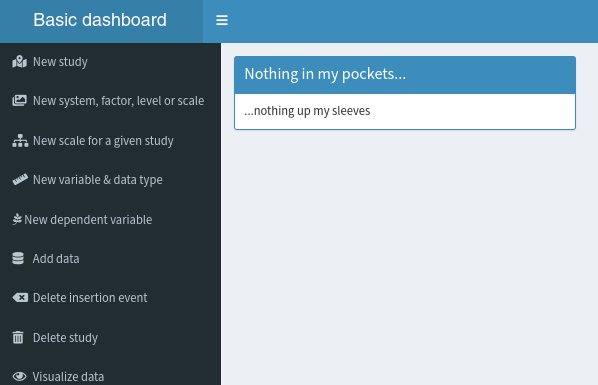

So, let's get moving and insert our first study into the database.

*Spoiler alert:* Below you can see how the welcome screen will look like after inserting all sample files.

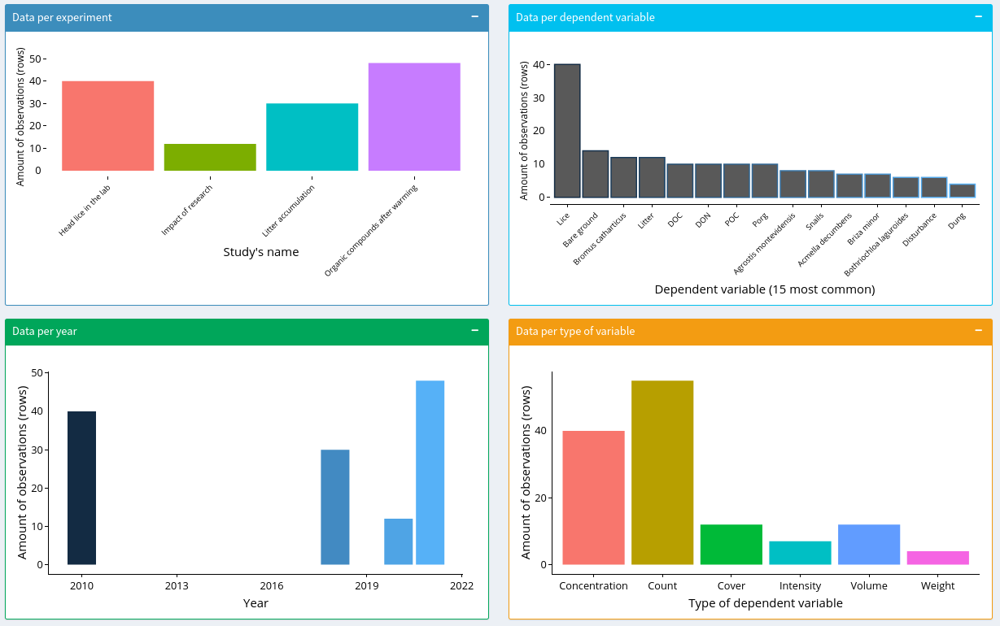

## New study
The first step is to define the general characteristics of the study we intend to insert. Throughout the GUI, the *Submit* button will not be enabled until all mandatory fields are filled without inconsistencies between them (i.e. the same column is referred in two different fields).
Please note that:

* Latitude and longitude should be inserted in decimal format (see figure) when defining a new place

* Date should be supplied as YYYY-MM-DD

* Study details should be comprehensive enough to grant that the design could be undertood by anyone in the future.

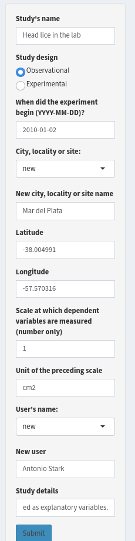

## New system, factor, level or scale
For most ecological studies it will also be necessary to define which factors and levels are being evaluated. Thus, in this menu option we provide this information. 

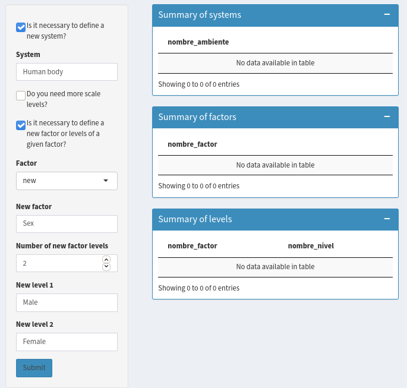

Obviously, given that we are inserting information for the first time into the database, the blue boxes don't show any recorded values. 

As the database expands and new studies are inserted, these boxes will show available values (to avoid duplicated systems, factors, levels).

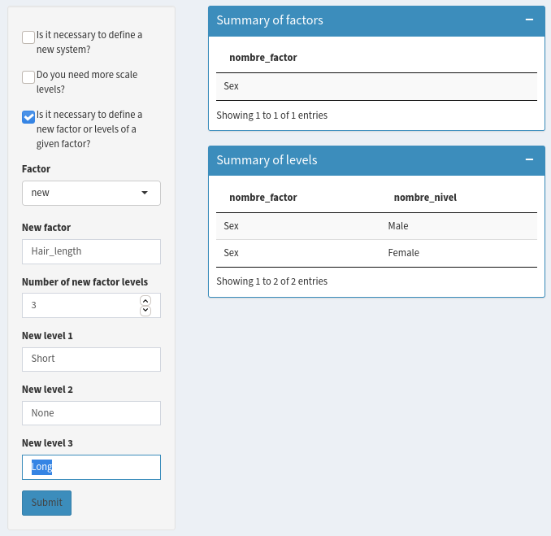

To preserve the correct functioning of the database, please remember:

* There are four pre-defined scale levels in the database (i.e. Block, Plot, SubPlot, SubSubPlot; see main text). Thus new scale levels should be added *only* if there is a fifth element in the spatial scale hierarchy. We believe that this option will rarely be needed.

* When defining a new factor, you can also specify how many levels it has. Those levels can be inserted in any orther, no need to match the spreadsheet.

* Always verify first if the new addition you are about to introduce is really needed

* When we designed this menu, we decided to avoid automatic insertion of new factors and levels to force the user to check whether they (or similar) were already available in the database. Unfortunatelly this leads to a manual insertion of the unique values of continuos explanatory variables.

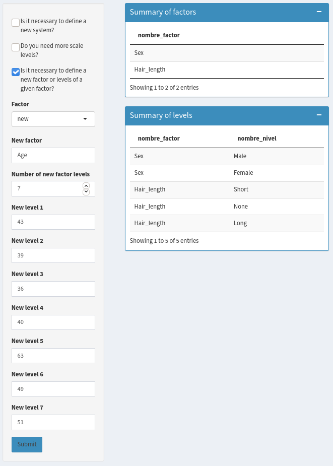

## New scale for a given study
Now it is time to associate the new study with its spatial design.
For this purpose, you need to first upload the spreadsheet and select the correct sheet. Data could be stored in wide or long formats but should follow certain rules (see main text for specifications). Here you can use the sample file [lice.xlsx](files/lice.xlsx).

Here you can add latitude and longitude for each level of the largest scale (Block). For example, if researchers are being considered the blocks (see main text), you can provide latitude and longitude for all or some of them. *It is very important to associate a given scale to its corresponding study*. If another study is selected, the insertion of data (see below) will fail.

## New variable & data type
Now it's time to define  some general characteristics of the dependent variables. There are two major groups of attributes that we can define in this option:

* *Data type* refers to some term that groups data (i.e. a larger group that includes several dependent variables usually measured). For convenience, we provide the database with four of these values inserted. We think that these values are useful to group living beings (i.e. Plantae, Animalia, Fungi and Bacteria). For non-living beings, different grouping criteria could be used according to user needs (e.g. organic, inorganic, chemical, physical, nutrients, disturbances). *It is very important to add data types before variable types* (i.e. in a previous submission event; otherwise the data type could not be associated with the variable type).

* *Variable type* refers to some term that groups dependent variables according to how they were measured or analyzed (e.g. cover, biomass, count, concentration, density, intensity). When adding a new variable type, you should also define to which data types it could eventually be applied (even if it is not the case in the current study). For example, all living beings could be counted, and thus a new variable type "count" should apply to the four pre-defined data types. 

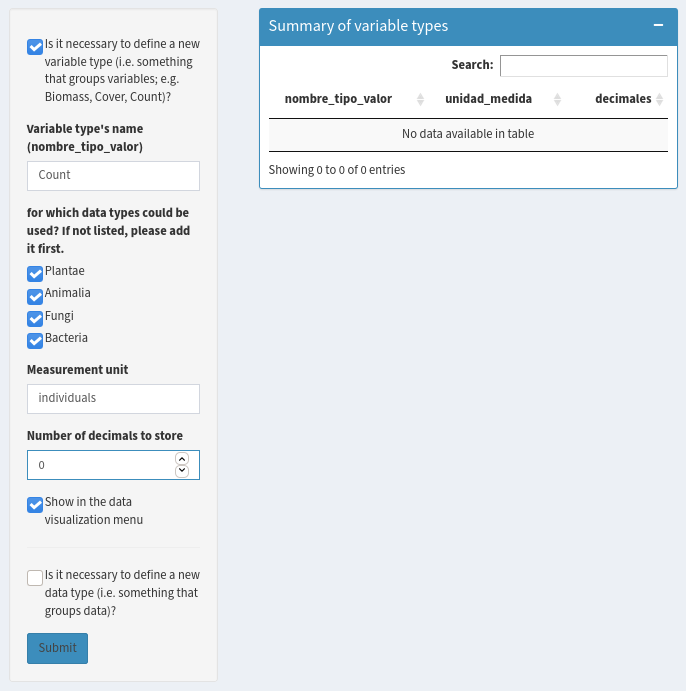

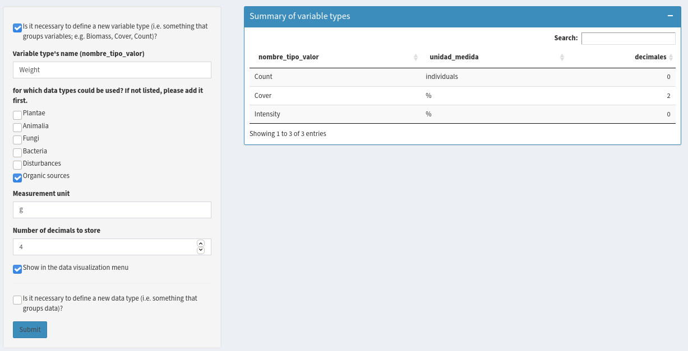

## New dependent variable
Here is were dependent (response) variable names are inserted into the database. Given that ecological studies usually measure several dependent variables, that are grouped into different variable types, and that those variables have generally useful information associated, this is probably the most complex element of the GUI. Dependent variables can be bulk or manually inserted from a given spreadsheet, that can be organized in long or wide formats. A nearly unlimited variety of additional information could be associated to these dependent variables, particularly for those that are not living beings. To ease this process, dependent variable names are extracted from the main spreadsheet or from a supporting _taxa_ file.

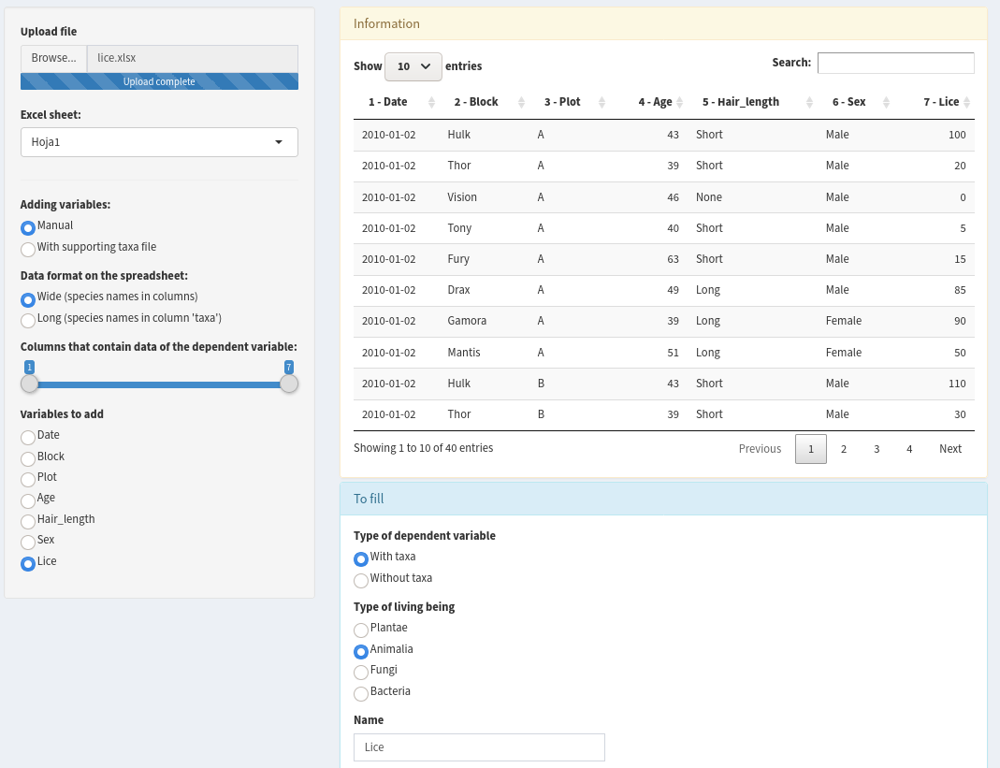

Given that living beings (taxa) share similar associated information (e.g. kingdom, family, genus, provenance, life form), this information can be bulk-inserted (i.e. all at once) using a supporting file ([taxa.xls](files/taxa.xls)). The content of this sample file can be edited according to user needs, but *it is essential to preserve column names* because otherwise the insertion process would fail.

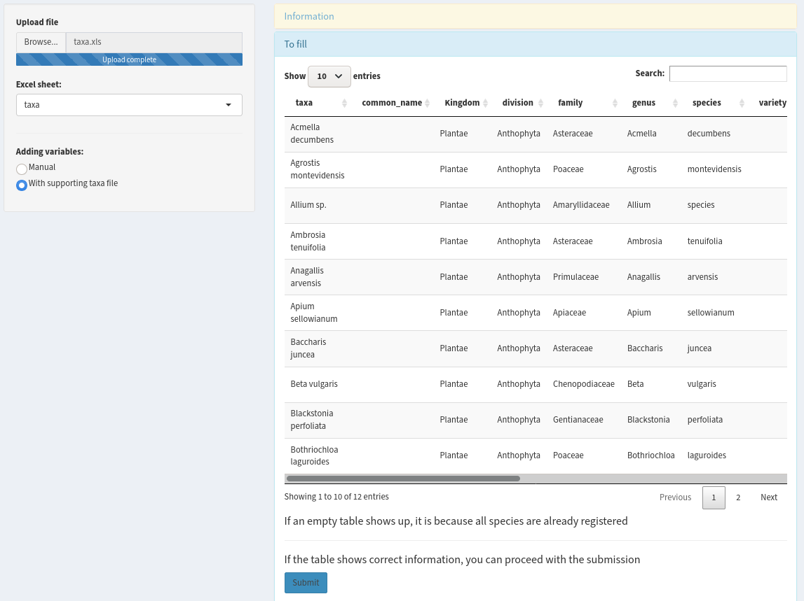

## Add data
This is likely the most interesting step, when measured values will be finally inserted into the database after doing tons of boring tasks. Several steps are required to insert data.

* Upload the main spreadsheet (used in previous steps)
* Define whether data is stored in wide or long formats
* Decide if stop insertion if changed values are detected or if them should be updated (it only applies for a second insertion of data for the same experiment).
* Select the user responsible of the study
* Select the study whose data is about to be inserted
* Specify column ranges for scales and factors
* Select the variable types included in the spreadsheet
* Specify column range of dependent variables
* Submit!
* Complain because you didn't read this guide and something went wrong.

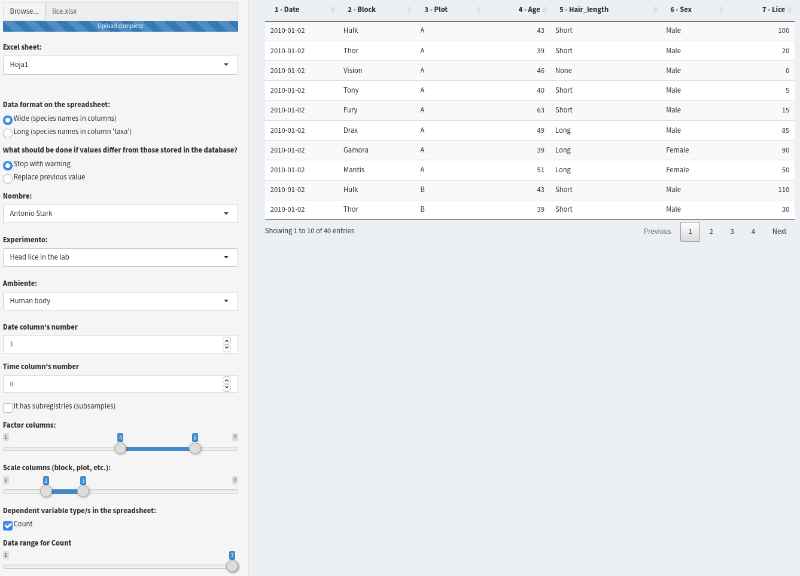

Once data values are successfully submitted to the database, an insertion event is created (which allows roll back in the future; see next section), and the GUI presents a summary of the operation:

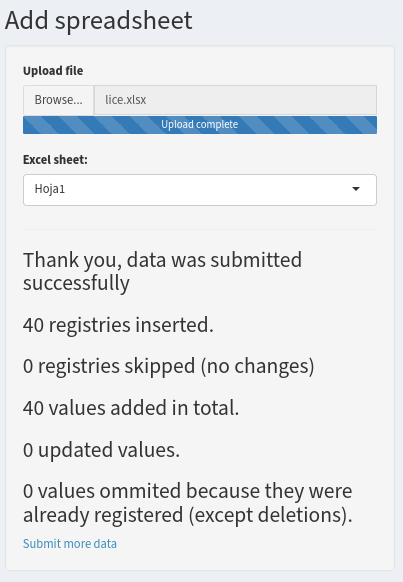

In a more complex case, the spreadsheet can contain subregistries. Each registry is typically a row in usual spreadsheets, while subregistries are like registries dependent on other registries. Consider for example that someone measures litter accumulation after prolonged nutrient addition in grassland plots. Now imagine that some of those plots have dung piles  that could affect litter accumulation. Thus, the researcher wants to take this into account by measuring the volume of each dung pile in each plot. Eventually, several dung piles could be measured per plot, and thus, the volume of each dung pile per plot would be a subregistry of the main registry (which has one value per plot). Sample files for inserting subregistries are [subregistries.csv](files/subregistries.csv) and [subregistries.xlsx](files/subregistries.xlsx). In addition to previous steps, there are some more to take into account:

* The box _It has subregistries_ needs to be selected
* Three additional columns need to be defined:
  + One that contains the id of the registry (the column with an unique identifier for each row). This column (_Column containing sample number_) is needed to match the registry with the subregistry
  + Another column (_Column referring to sample number_) with the parent id (i.e. registry id) the subsample belongs to. The value of the cell in this column must match one of the values from the previous column (to match registry with subregistry)
  + Finally a column with a unique identifier for subregistries (_Column referring to subsamble numbers_). This way, each subregistry could be identified and eventually updated or followed over time.
  
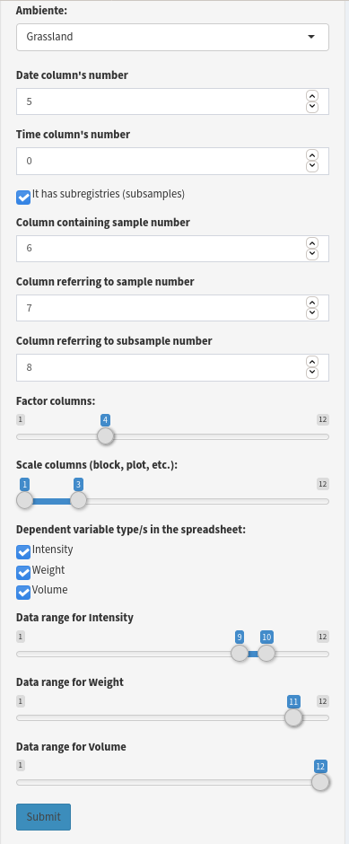

As stated above, it is also possible to upload data in the long format. The fields are partly different:

* Only one variable type  at a time can be inserted
* The user needs to specify the column containing dependent variable names
* The user needs to specify the column containing dependent variable values
* If there are more columns containing dependent variable values (e.g. for each plant species -dependent variables-, biomass and cover -different variable types- were measured), those columns should be omitted.
* If there are no more columns, then, this should be specified.

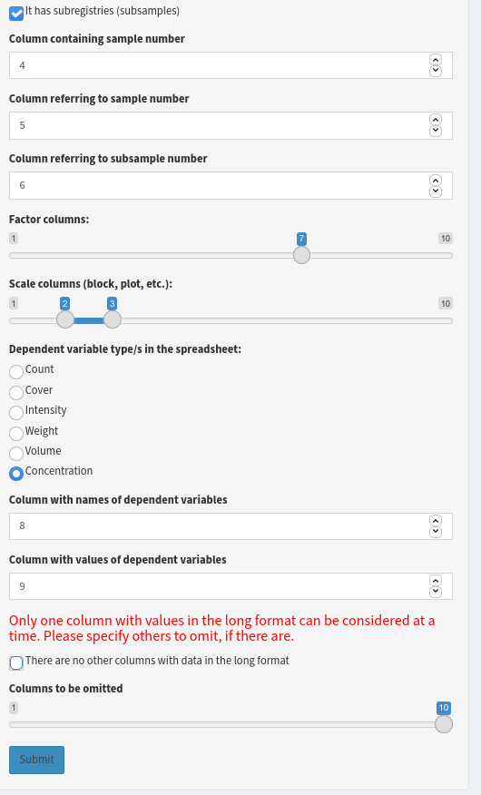

## Delete insertion event
Quite often ecologists mess up spreadsheets, and after some time they realize that the spreadsheet needs to be fixed. Haven done this many times, we acknowledged that it is necessary to include an option to roll back insertions. After selecting the responsible user, the desired study and the insertion event that supposed to be wrong, the main panel shows data inserted. If data is indeed wrong, the user can proceed by pressing _Delete_. *Remember that this action cannot be undone*

## Delete study
If you eventually screw things up more seriously (could happen, certainly many times in our case), you can alway delete the study and all its associated content. *Remember that this action cannot be undone*. This way, if after deleting an experiment you want to insert it again, you'll need to fill _New study_, _New scale for a given study_, and _Add data_ again. 

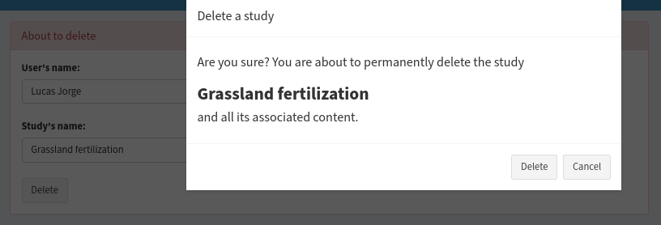

## Visualization
This is likely the most interesting option once you have inserted a few studies. Here, you can:

* Select which data types you want to see
* Select which studies to show
* Define the range of years to be included
* Visualize in which locations you have data
* See the description of those selected studies
* Have an overview of the factors and levels included, as well as how many observations they have
* Visualize and table with the results, with the possibility of filtering by any of the columns
* Download the data in csv or xlsx.

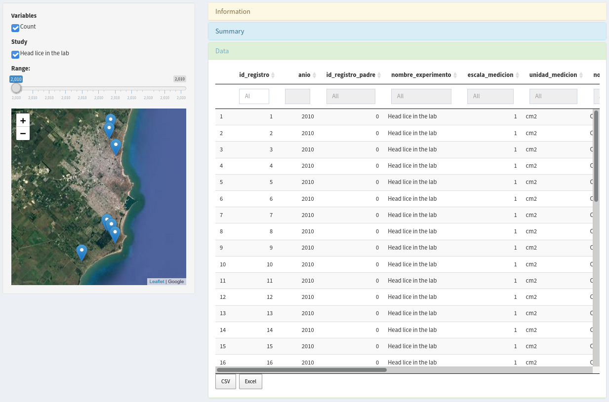

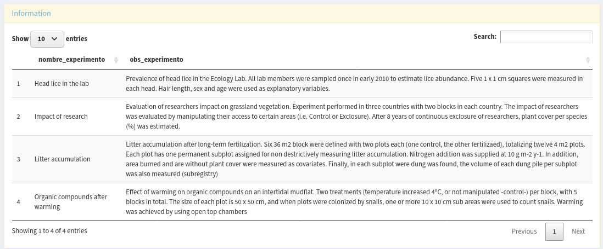

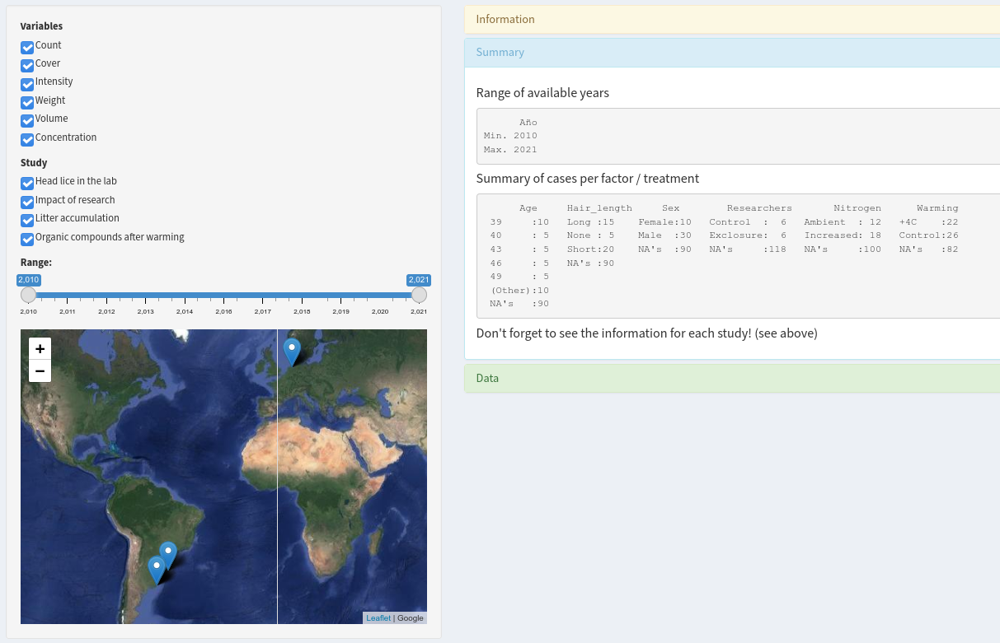

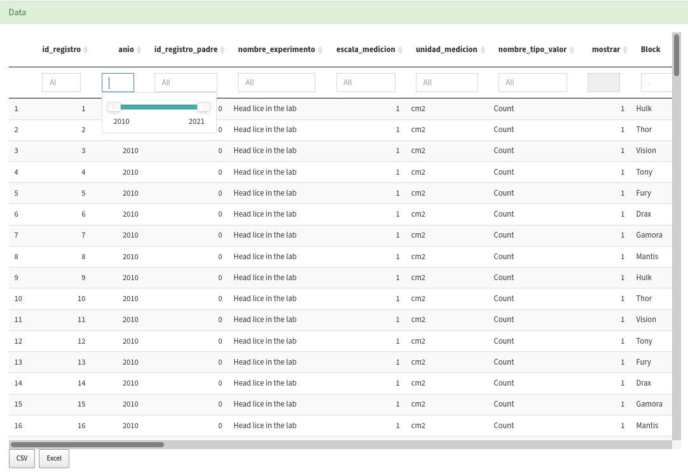

## References
<a id="1">[1]</a> 
Winston Chang, Joe Cheng, JJ Allaire, Carson Sievert, Barret Schloerke, Yihui Xie, Jeff Allen, Jonathan
  McPherson, Alan Dipert and Barbara Borges (2021). shiny: Web Application Framework for R. R package version
  1.6.0. https://CRAN.R-project.org/package=shiny

<a id="2">[2]</a> 
Winston Chang and Barbara Borges Ribeiro (2018). shinydashboard: Create Dashboards with 'Shiny'. R package
  version 0.7.1. https://CRAN.R-project.org/package=shinydashboard